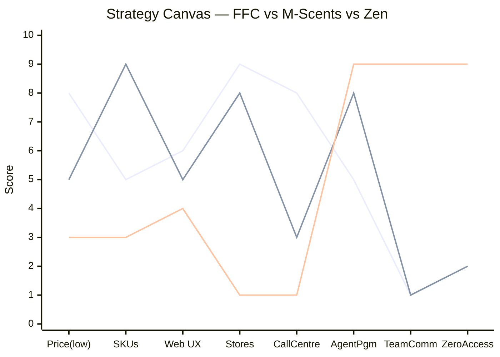
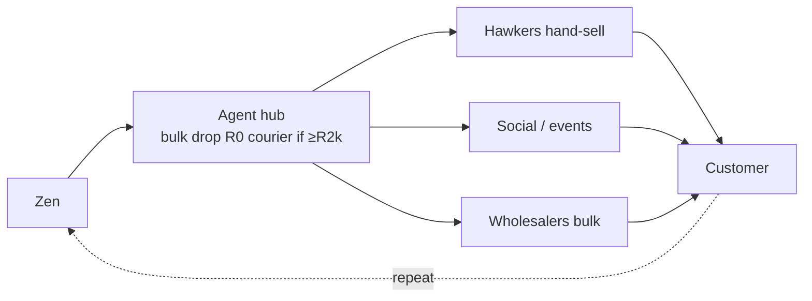
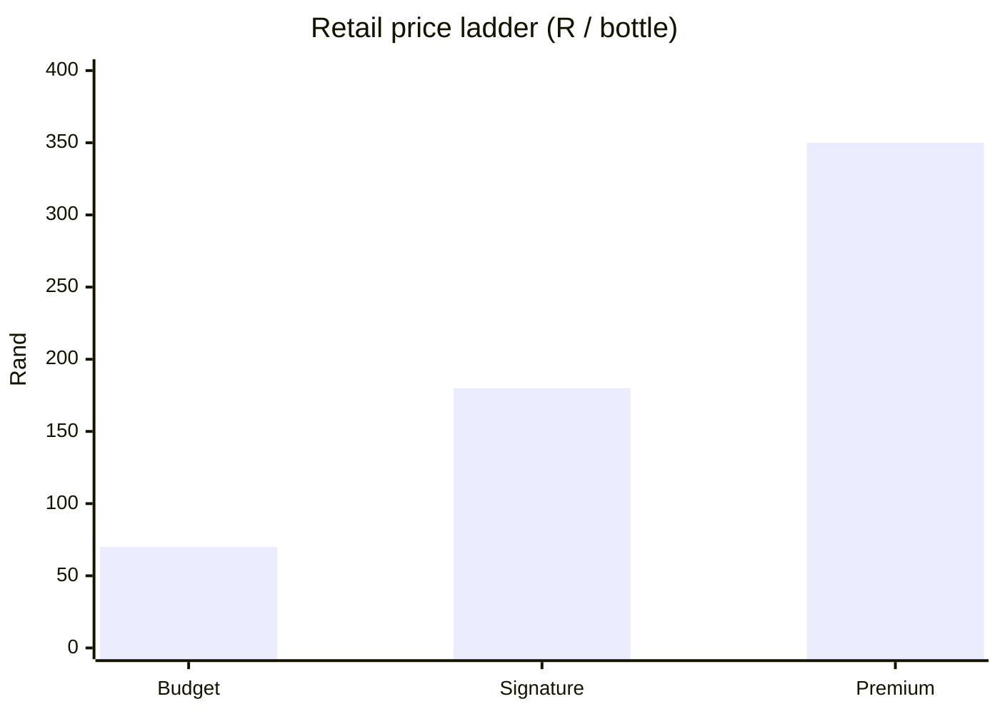
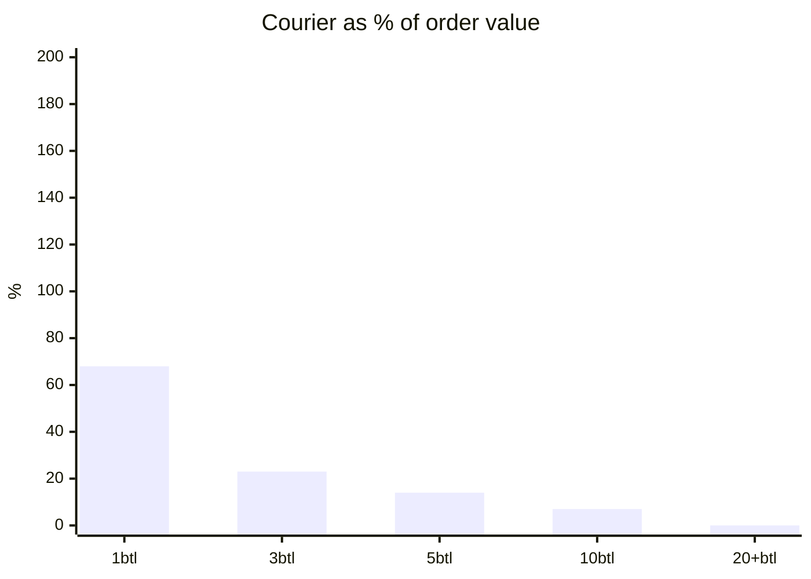
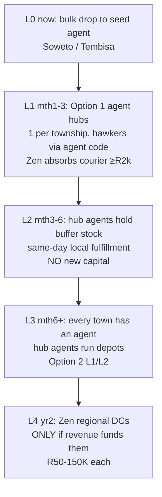
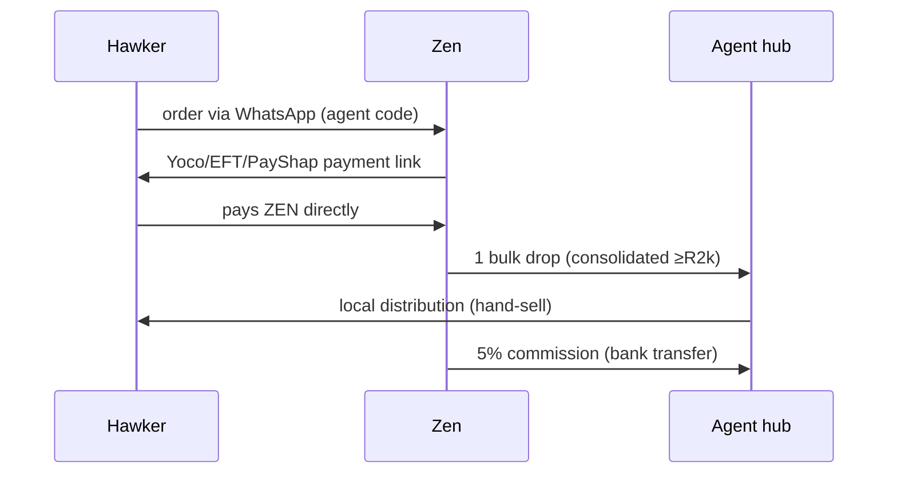
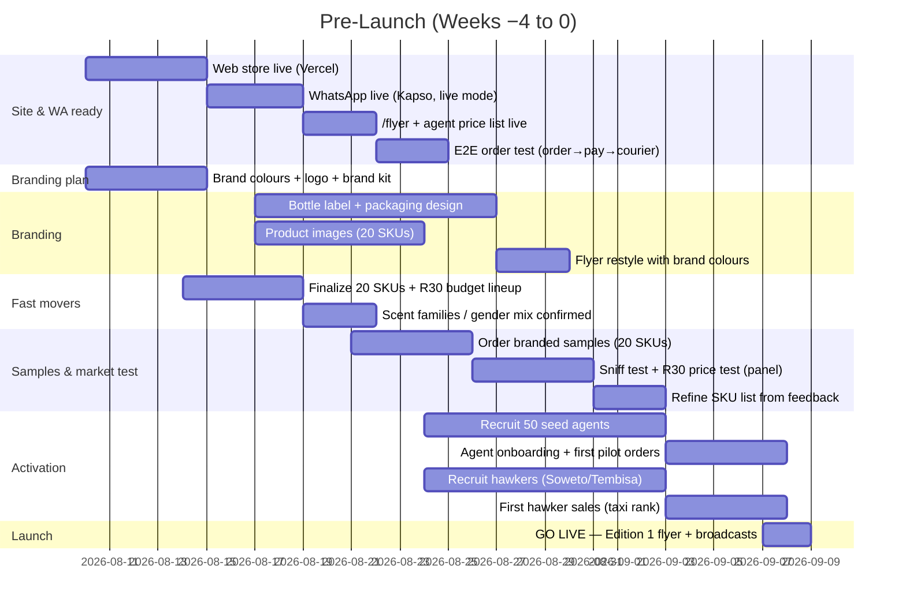
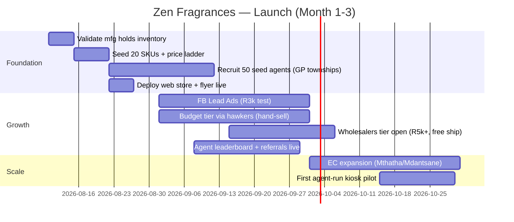
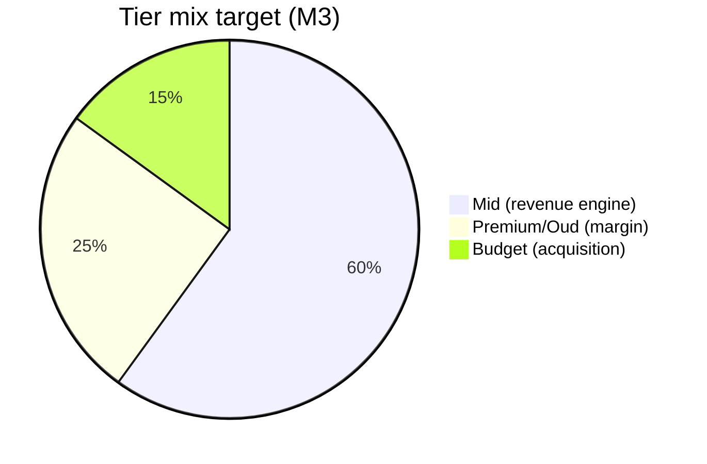

# Zen Fragrances — GTM Master Plan (Visual Edition)

**Consolidated 2026-08-08** · Single source for the go-to-market strategy.
Charts = Mermaid (renders in VS Code preview + GitHub). Tables = markdown.
*Docs that feed this: gtm-strategy.md · competitive-geography.md · launch-plan.md · distribution-options.md · flyer-cadence.md · production-questions.md*

---

## 1. THE PITCH (one paragraph)

> Zen Fragrances enables anyone in South Africa with a WhatsApp phone to own a perfume business — zero upfront cost, instant activation, two ways to earn. We eliminate the barriers (no starter pack, no website needed), reduce complexity (lean 20-SKU launch), raise agent autonomy (own pricing, team building, earnings transparency), and create new capabilities (WhatsApp-as-store, agent network as distribution, confirmation-before-cart). Our market isn't existing perfume buyers — it's the millions of South Africans looking for flexible income.

---

## 2. STRATEGY CANVAS — where we DON'T compete

**Legend:** 🔵 FFC (national warehouses) · 🟢 M-Scents (KZN stores) · 🟣 Zen (people-network)
We under-invest in what they compete on; we own accessibility + team economics.

---

## 3. CHANNEL STRATEGY — 6 channels

| Channel | Verdict | Capital | Courier | Role |
|---|---|---|:---:|---|
| **WhatsApp (agents)** | ✅ Core | R0 | Bulk drop | Ordering + communication (the moat) |
| **Web store** | ✅ Keep | R0 | Min R500 | Discovery, SEO, agent locator |
| **Agents** | ✅ Core | R0 | — | The distribution army |
| **Wholesalers** | ✅ Push | R0 | Free-ship | Bulk volume |
| **Hawkers** | ✅ Budget tier | R0 | Hand-sell | Township impulse + penetration |
| **Stores (consignment)** | 🟡 Defer | R5–20K/store | Bulk | Only after profitable |

---

## 4. PRICING — 3-TIER LADDER (20 launch SKUs)

| Tier | Sizes | Wholesale | Retail (2×) | SKUs | Role |
|---|---|---|:---:|:---:|---|
| 🟢 Budget | 30ml | R30–50 | R60–100 | 6 | Acquisition / impulse / hand-sell |
| 🟡 Signature | 80–100ml | R80–100 | R160–200 | 10 | **The revenue engine** |
| 🔴 Premium/Oud | 100ml | R150–200 | R300–400 | 4 | Margin + gifting |
| 🎁 Add-ons | sets/spritzers | R8–45 | R20–90 | — | Upsell, gift trigger |

**Budget-tier rule:** never shipped alone (courier = 186% of value). It's a hand-sell acquisition tool, not a profit engine.

**🚀 INITIAL LAUNCH STRATEGY (2026-08-08):** lead with the **BUDGET tier** at a starting price point of **R30**. Agents get **5% off this price** (agent cost **R28.50**) and sell at ~2× (**R60 retail**, agent-set). Budget-first = lowest entry barrier, fastest agent recruitment, and hand-sell friendly (no courier on single budget bottles). Signature/premium tiers are added as agents grow.

---

## 5. COURIER ECONOMICS — the math that picks the channel

| Order | Value | Courier | % of value | Viable? |
|---|:---:|:---:|:---:|---|
| 1 budget | R35 | R65 | **186%** | ❌ loss |
| 1 mid | R95 | R65 | 68% | ❌ |
| 5 mid | R475 | R65 | 14% | 🟡 |
| 10 mid | R950 | R65 | 7% | ✅ |
| 20+ bottles | R2,000+ | R0 | 0% | ✅ best |

**Rule:** courier sustainable ≤10–13% of value → **minimum shipped order = R500 / 5 bottles**. The agent is the last-mile courier (one bulk drop, local hand-sell).

---

## 6. DISTRIBUTION — PENETRATION LADDER (zero capital → scale)

**No-money-handling flow** (agents never touch cash):

**💳 Payment pathways (hawker/agent pays ZEN directly — agents never handle money):**

| Payment method | How it works | Clears |
|---|---|---|
| Yoco card link | Link sent on WhatsApp / web checkout | Instant |
| EFT + POP | Bank transfer + proof-of-payment image | 1–2 working days (manual verify) |
| PayShap / mobile money | Instant bank-to-bank via phone | Instant |
| Cash (exception) | Cash-only hawkers — collected by agent, capped per agent | Paid by agent to Zen (exception only) |

**📦 Collection / courier once payment is made:**
1. Payment confirmed (POP verified / idempotency)
2. Zen consolidates the agent's group of paid orders
3. **Courier Guy** to agent (R65 flat; **FREE over R2,000**) **OR Pargo/Pudo pickup point** (rural — agent collects)
4. Agent distributes locally (hand-sell)

**Rule:** budget bottles are hand-sold or bundled — never couriered alone.

---

## 7. GEOGRAPHY — where we enter (from competitive-geography)

| Priority | Region | Why | Status |
|:---:|---|---|---|
| **1** | **Gauteng townships** (Soweto, Tembisa, Mamelodi, Alexandra, Katlehong) | FFC = city warehouses only; M-Scents absent | Wave 1 |
| **2** | **Eastern Cape** (Mthatha, Mdantsane, Gqeberha) | Both competitors thin; M-Scents Mthatha signal | Wave 2 |
| ⛔ | **KZN** (Durban, PMB) | Saturated — M-Scents 14 stores + FFC | Avoid |

**Only competitor overlap = KZN.** Everywhere else is contested by one player or none.

---

## 8. PRE-LAUNCH + 90-DAY LAUNCH PLAN

### Pre-Launch (weeks −4 → 0 · 2026-08-10 → 2026-09-07)

### Pre-launch checklist (gate-based)

| # | Track | Deliverable | Week | ✅ Exit criteria (Gate) |
|:---:|---|---|:---:|---|
| 1 | **Site & WA ready** | Web store + WhatsApp + /flyer + price list live | −4→−3 | E2E order test passes **+ UX audit** (checklist.design: Landing, Catalogue, Product Detail, Cart, Checkout + add-to-cart/payment flows) |
| 2 | **Branding plan** | Colours + logo + brand kit approved (use tasteskill `brandkit` skill) | −4 | Founder sign-off |
| 3 | **Branding** | Label, packaging, product images, flyer restyle; **no-ai-slop** pass on all copy | −3→−2 | 20 SKUs have branded `thumbnail_url` images; copy sounds human |
| 4 | **Fast movers** | Finalize 20 SKUs (6 budget / 10 signature / 4 premium) + R30 lineup | −3 | SKU list frozen |
| 5 | **Samples / test in market** | Branded samples; sniff + R30 price test with panel | −2→−1 | SKU list refined from real feedback |
| 6 | **Activate agents** | Recruit 50 seed agents; onboarding + first orders | −1→0 | 50 active · ≥10 pilot orders placed |
| 7 | **Activate hawkers** | Recruit hawkers (Soweto/Tembisa); first taxi-rank sales | −1→0 | First hawker sales recorded |
| 8 | **GO LIVE** | Edition-1 flyer + agent/hawker broadcasts; transitions.dev polish on key pages | 0 | Live |

*Full UI/UX toolkit + post-launch dashboard charts (Microsoft Flint): [ui-ux.md](ui-ux.md)*

### 90-Day Launch (month 1–3)

---

## 9. KPI DASHBOARD (North Star)

| Metric | M1 | M3 | M6 |
|---|:---:|:---:|:---:|
| Active agents | 100 | 500 | 2,000 |
| Monthly orders | 200 | 1,500 | 6,000 |
| Monthly GMV | R70K | R600K | R2.7M |
| Courier cost % of revenue | < 8% | < 6% | < 5% |
| Budget tier share | < 60% (budget-first) | < 40% | < 20% |
| Avg agent order | R1,500 | R1,800 | R2,000+ |
| CAC / active agent | < R80 | < R60 | < R50 |

---

## 10. COMPETITIVE POSITIONING (one-line each)

| vs | Our line |
|---|---|
| **FFC** | "Start with 1 bottle, R65" vs their R960 starter pack + web-only |
| **M-Scents** | "No starter pack, WhatsApp-first, team commissions, Gauteng" vs their R800–R3,750 + KZN-only |
| **Fragrance Boutique** | "Become an agent instantly" vs application-based |

---

## 11. GTM APPROACHES CONSIDERED (strengths & weaknesses)

| GTM approach | What it is | Strengths | Weaknesses | Verdict |
|---|---|---|---|---|
| **WhatsApp-first agent platform** (chosen) | Agents order via WhatsApp, zero barrier, team commissions | Lowest friction in SA; no app/login; network effects; low-literacy friendly | No physical sniff test; needs agent recruitment; courier forces bulk | ✅ Core |
| **National warehouse + web + call centre** (FFC model) | 15 warehouses, web ordering, call centre | National reach; proven; brand recognition | R960 barrier; web-only friction; high capex; shallow in communities | ❌ Not ours |
| **Physical retail stores** (M-Scents model) | 21 walk-in stores | Community trust; sniff test; cash sales | Capital-heavy; regional; rent/staff; slow scale | 🟡 Defer — agent hubs replace stores |
| **Direct-to-consumer web** | Public buys on web, courier to door | Full margin; SEO | Single-bottle courier kills economics; needs ad spend | ⚠️ Weakest channel |
| **Branded distribution** (license Motala/P2D) | Carry/license third-party registered brands | Instant brand trust; gift sets; price ladder | Thin margin; no brand equity for US; replaceable middleman | 🟡 LATER, optional licensing |
| **Own-brand manufacturing (private label)** — CHOSEN | We produce + sell under the **Zen** brand via contract manufacturer; license 3rd-party names later | Full margin; full brand equity; owns the vertical; not replaceable | Needs own packaging/brand investment; brand trust builds over time | ✅ Chosen (day 1) |
| **Hawker / micro-retail network** | Taxi-rank hand-sell | Zero courier; impulse; township penetration | Small per-unit margin; management heavy | ✅ Budget-tier channel |
| **Hybrid (SELECTED)** | WhatsApp agents + web discovery + hawker budget + wholesaler bulk | All of the above; courier-optimal; zero capital | Orchestration complexity | ✅ Chosen |

---

## 12. SWOT (readable summary)

| 💪 STRENGTHS (internal) | 🩸 WEAKNESSES (internal) |
|---|---|
| Zero barrier (no R960 starter pack) | No physical presence / no sniff test |
| WhatsApp-first (95% of SA have it) | No brand recognition yet |
| Two-sided earning (margin + 5% team) | Single manufacturer (contract) — dual-source |
| 6 role dashboards + agent locator | No proprietary scents (dupes only) |
| Confirmation-before-cart; click-through links | No card payments on WhatsApp |
| Automated mfg forwarding; lean iteration | 0 of 99 SKUs seeded; single-size plan |

| 🚀 OPPORTUNITIES (external) | ⚠️ THREATS (external) |
|---|---|
| R750B township economy + side-hustle culture | FFC adds WhatsApp / drops starter price |
| WhatsApp = SA super-app (join habit, not build) | Copycat entrants (speed is the moat) |
| FFC's R960 barrier = our lead source | WhatsApp policy changes (Kapso buffers) |
| Social commerce boom → agents = free sales force | Manufacturer failure (dual-source by mth 3) |
| Agent network = last-mile distribution (no rent) | Pyramid perception (commission on orders only) |
| Corporate gifting; SADC cross-border; data monetization | Courier theft; counterfeit stigma; rand volatility |

*Full 10/10/10/10 SWOT + Blue Ocean: [swot-blue-ocean.md](swot-blue-ocean.md)*

---

## 13. COMPETITOR LANDSCAPE (factual)

| Competitor | SKUs | Sizes | Wholesale | Retail | Starter | Footprint | Ordering |
|---|---|:---:|:---:|:---:|:---:|---|---|
| **FFC** | 42 | 30ml only | R19–94 | R40–190 | R960 | 15 warehouses (national) + kiosks | Web + call centre |
| **M-Scents** | 241 | 15ml–200ml | R15–200 | R30–400+ | R800–3,750 | 21 stores (ALL KZN) | Web only |
| **Fragrance Boutique** | 40+ | 50/100ml | — | R219–419 | Application | 1 store (CPT) | Web + WhatsApp + physical |
| **Perfumes for Africa** | 40+ | 5ml–100ml | — | R12–133 | — | 1 store (CPT) | Web + WhatsApp + physical |
| **SensoryFX / Sensetek** | B2B | — | — | — | — | Centurion / Sandton | — |

**Facts that drive the plan:**
- Only competitor overlap = **KZN** (Durban + PMB). Gauteng townships have NO competitor community presence.
- The market leader (FFC) is **web-only with a R960 barrier**; the second (M-Scents) is **web-only, KZN-only, with a R800+ barrier**.
- No competitor has team commissions, WhatsApp-first ordering, or agent-as-distribution.

*Full profiles: [competitors.md](competitors.md) · footprint contrast: [competitive-geography.md](competitive-geography.md)*

---

## 14. OWNING THE VERTICAL — own-brand first (CORRECTED 2026-08-08)

**Decision:** we will **PRODUCE and SELL the perfumes under our OWN brand (Zen)** from day 1 (contract manufacture — a partner makes the oil; we own the brand, bottle, packaging, price). **Licensing third-party brands (Motala/P2D/Parfumo) is a LATER, optional expansion** — not the launch path.

**What this means:** we own the full vertical from the start — brand + product + agent network + distribution + data.

| Assumption | Impact of own-brand-first |
|---|---|
| **Moat** | Stronger — we're a platform + a brand, not a replaceable distributor |
| **Brand** | **Critical from day 1** — we must build Zen brand equity ourselves (packaging, quality perception, brand colours). No borrowed trust |
| **Margin ceiling** | **Higher from day 1** — full margin (no distributor/licensing cut) |
| **Manufacturer dependency (W3)** | Critical — contract manufacturer makes our oil. Dual-source (SensoryFX/Sensetek) is mandatory; private-label capability is the requirement |
| **Zero-capital launch** | Mostly unchanged — contract manufacturer holds inventory; we invest in own-label packaging/brand as the launch cost (confirm the contract manufacturer can private-label + hold stock) |
| **Counterfeit perception (T6)** | More relevant — our own brand must NOT look like a fake. Quality packaging is non-negotiable |
| **Licensing (later)** | Optional expansion once we have scale + brand recognition — add Motala/P2D/Parfumo to broaden the shelf |

**Bottom line:** we are an **own-brand perfume company** (contract-manufactured, own label), not a distributor of other brands. Licensing is a later accelerant, not the foundation.

---

## 15. OPEN ITEMS

- [ ] Verify M-Scents **Mthatha** store (not on their locator yet)
- [ ] Set `FLYER_WHATSAPP` in Railway for the flyer CTA
- [ ] Confirm **the contract manufacturer** can private-label (our Zen brand) + hold inventory (the model depends on it)
- [ ] Define **Zen own-brand identity**: name/bottle/packaging/brand colours (launch-critical)
- [ ] Confirm **dual-source** private-label capability (SensoryFX/Sensetek) — mandatory hedge
- [ ] Consider **licensing** Motala/P2D/Parfumo LATER (optional expansion, not launch)
- [ ] Seed 20 SKUs under the **Zen brand** with `thumbnail_url` images
- [ ] Refine flyer styling once **brand colours** are chosen
